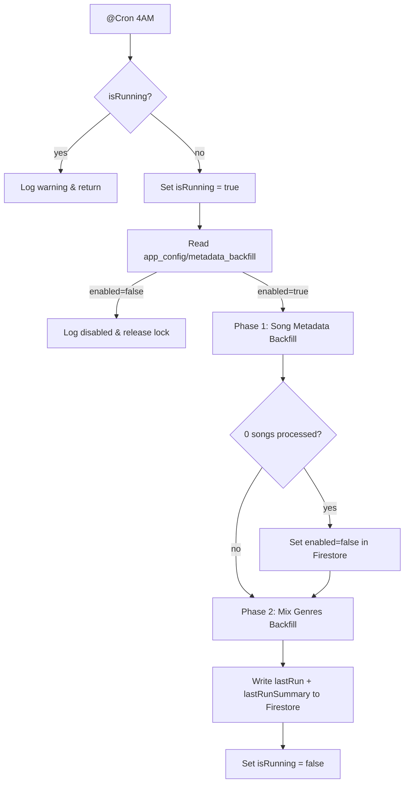

# Design Document: Metadata Backfill Scheduler

## Overview

The `MetadataBackfillScheduler` is a NestJS injectable that runs a daily cron job at 4:00 AM. It performs two coordinated background phases:

1. **Song metadata backfill** — finds songs in Firestore missing key metadata fields and enriches them via `SongsService.refreshMetadata()` (which calls Last.fm).
2. **Mix genres backfill** — finds `youtube_searches` documents containing mix entries without a `genres` field and classifies them via `GeminiService.generate()`.

Both phases are gated by a Firestore flag document (`app_config/metadata_backfill`). When the song phase completes with zero songs needing update, the scheduler auto-disables itself by setting `enabled: false` on that document.

The scheduler follows the same structural pattern as the existing `SearchRefreshScheduler` — a single `isRunning` guard, a `Logger`, and a `delay()` helper — extended with pagination, per-phase result tracking, and Firestore config management.

---

## Architecture



The scheduler lives entirely in `src/songs/metadata-backfill.scheduler.ts` and is registered in `SongsModule`. It depends on `FirestoreService`, `SongsService`, and `GeminiService` — all already available in `SongsModule` via `FirestoreModule` and `SyncModule` imports.

---

## Components and Interfaces

### MetadataBackfillScheduler

```typescript
@Injectable()
export class MetadataBackfillScheduler {
  private readonly logger = new Logger(MetadataBackfillScheduler.name);
  private isRunning = false;

  constructor(
    private readonly firestore: FirestoreService,
    private readonly songsService: SongsService,
    private readonly gemini: GeminiService,
  ) {}

  @Cron(CronExpression.EVERY_DAY_AT_4AM)
  async runBackfill(): Promise<void>

  private async runSongMetadataPhase(): Promise<SongPhaseResult>
  private async runMixGenresPhase(): Promise<MixPhaseResult>
  private async readBackfillConfig(): Promise<BackfillConfig>
  private async writeRunSummary(summary: RunSummary): Promise<void>
  private delay(ms: number): Promise<void>
}
```

### Internal Interfaces

```typescript
interface BackfillConfig {
  enabled: boolean;
  lastRun?: Date;
  lastRunSummary?: RunSummary;
}

interface SongPhaseResult {
  processed: number;
  skipped: number;
  failed: number;
}

interface MixPhaseResult {
  documentsUpdated: number;
  entriesEnriched: number;
}

interface RunSummary {
  startedAt: Date;
  completedAt: Date;
  durationMs: number;
  songPhase: SongPhaseResult;
  mixPhase: MixPhaseResult;
}
```

### SearchMixDto (updated)

The `SearchMixDto` in `src/songs/dto/search-youtube-response.dto.ts` gains a `genres` field:

```typescript
export class SearchMixDto {
  title: string;
  youtubeId: string;
  thumbnailUrl: string;
  rank: number;
  genres: string[];   // NEW — populated by scheduler; empty array when not yet classified
}
```

The `enrichSearchResults` method in `SongsService` (which reads `youtube_searches` docs and maps them to the response DTO) must default `genres` to `[]` when the field is absent from the Firestore document.

---

## Data Models

### Firestore: `app_config/metadata_backfill`

| Field | Type | Description |
|---|---|---|
| `enabled` | `boolean` | Gates all scheduler runs. Defaults to `true` when document is absent. |
| `lastRun` | `Timestamp` | Set at the end of every completed run. |
| `lastRunSummary` | `object` | Mirrors `RunSummary` — durations, per-phase counts. |

### Firestore: `songs/{id}` — Missing Metadata Detection

A song document is considered to have **missing metadata** when at least one of the following fields is absent or empty:

| Field | Missing condition |
|---|---|
| `genres` | absent or `[]` |
| `tags` | absent or `[]` |
| `album` | absent or `null` or `""` |
| `coverImageUrl` | absent or `null` or `""` |
| `listeners` | absent or `0` |
| `mbid` | absent or `null` or `""` |

The scheduler queries `songs` ordered by `createdAt` ascending and pages through results in batches of 50. For each document it checks the above conditions client-side (Firestore `where` with `OR` across multiple fields is not supported without composite indexes).

### Firestore: `youtube_searches/{query}` — Stale Mix Detection

A mix entry inside the `mixes` array is **stale** when its `genres` field is absent or is an empty array. The scheduler queries for documents where the `mixes` array is non-empty and processes up to 20 documents per run.

---

## Correctness Properties

*A property is a characteristic or behavior that should hold true across all valid executions of a system — essentially, a formal statement about what the system should do. Properties serve as the bridge between human-readable specifications and machine-verifiable correctness guarantees.*

### Property 1: Disabled flag prevents all backfill work

*For any* scheduler invocation where the Backfill_Config document has `enabled: false`, no calls to `SongsService.refreshMetadata` or `GeminiService.generate` shall be made.

**Validates: Requirements 2.3**

### Property 2: Auto-cancel sets enabled to false

*For any* scheduler run that completes the song metadata phase with zero songs processed, the Backfill_Config document's `enabled` field shall be `false` after the run.

**Validates: Requirements 2.4**

### Property 3: Song batch rate limiting

*For any* batch of N songs processed in the song metadata phase, the total elapsed time between the first and last `refreshMetadata` call shall be at least `(N - 1) * 200` milliseconds.

**Validates: Requirements 3.3**

### Property 4: Song cap enforcement

*For any* scheduler run, the total number of songs passed to `refreshMetadata` shall not exceed 500, regardless of how many songs have missing metadata in Firestore.

**Validates: Requirements 3.7**

### Property 5: Mix document cap enforcement

*For any* scheduler run, the total number of `youtube_searches` documents processed in the mix genres phase shall not exceed 20.

**Validates: Requirements 4.6**

### Property 6: Mix genres round-trip

*For any* `youtube_searches` document containing stale mix entries, after the mix genres phase processes that document, every previously-stale mix entry shall have a non-empty `genres` array in Firestore (assuming Gemini returns a valid response).

**Validates: Requirements 4.4**

### Property 7: SearchMixDto genres default

*For any* `youtube_searches` document read by `SongsService`, every mix entry in the API response shall have a `genres` field of type `string[]` — never `undefined` or `null`.

**Validates: Requirements 5.2, 5.3**

### Property 8: Run summary always written

*For any* completed scheduler run (whether or not any songs or mixes were processed), the Backfill_Config document shall be updated with a `lastRun` timestamp and a `lastRunSummary` object.

**Validates: Requirements 2.5**

---

## Error Handling

| Scenario | Behaviour |
|---|---|
| `isRunning` is `true` on cron trigger | Log warning, return immediately — no lock acquired |
| Backfill_Config document missing | Treat `enabled` as `true`, proceed normally |
| `refreshMetadata` throws for a song | Log error with song ID, increment `failed` counter, continue to next song |
| Gemini returns unparseable JSON for a mix batch | Log error, skip that document's update, continue to next document |
| Any unhandled error in `runBackfill` | Catch in outer try/finally, log message + stack trace, set `isRunning = false` to release lock |

The `finally` block in `runBackfill` always releases `isRunning`, ensuring a crashed run never permanently blocks future executions.

---

## Testing Strategy

### Unit Tests

Focus on the scheduler's orchestration logic using mocked dependencies:

- **Config flag check**: verify that when `enabled: false`, neither `refreshMetadata` nor `gemini.generate` is called.
- **Auto-cancel**: verify that when `refreshMetadata` is never called (zero songs with missing metadata), `firestore.doc('app_config/metadata_backfill').update` is called with `{ enabled: false }`.
- **Song cap**: verify that with 600 songs needing update, only 500 calls to `refreshMetadata` are made.
- **Mix cap**: verify that with 30 stale documents, only 20 calls to `gemini.generate` are made.
- **Error isolation**: verify that a `refreshMetadata` rejection for song N does not prevent song N+1 from being processed.
- **Run summary**: verify that `lastRun` and `lastRunSummary` are written at the end of every run.
- **SearchMixDto default**: verify that `enrichSearchResults` maps mix entries without `genres` to `genres: []`.

### Property-Based Tests

Using `fast-check` (already used in the project's `test/` directory):

**Feature: metadata-backfill-scheduler, Property 1: Disabled flag prevents all backfill work**
Generate arbitrary `BackfillConfig` objects with `enabled: false`. Assert that `runBackfill` exits without invoking `refreshMetadata` or `gemini.generate`.

**Feature: metadata-backfill-scheduler, Property 2: Auto-cancel sets enabled to false**
Generate a list of song IDs where all songs have complete metadata (so `refreshMetadata` is never needed). Assert that after `runSongMetadataPhase` returns `{ processed: 0 }`, the config update call includes `{ enabled: false }`.

**Feature: metadata-backfill-scheduler, Property 4: Song cap enforcement**
Generate arrays of song IDs with length between 501 and 1000. Assert that the number of `refreshMetadata` calls is always ≤ 500.

**Feature: metadata-backfill-scheduler, Property 5: Mix document cap enforcement**
Generate arrays of `youtube_searches` document stubs with length between 21 and 50. Assert that the number of `gemini.generate` calls is always ≤ 20.

**Feature: metadata-backfill-scheduler, Property 7: SearchMixDto genres default**
Generate arbitrary `youtube_searches` document data where mix entries may or may not have a `genres` field. Assert that every `SearchMixDto` in the mapped result has `genres` as a `string[]`.

Minimum 100 iterations per property test. Each test references its design property via a comment tag in the format: `// Feature: metadata-backfill-scheduler, Property N: <text>`.
