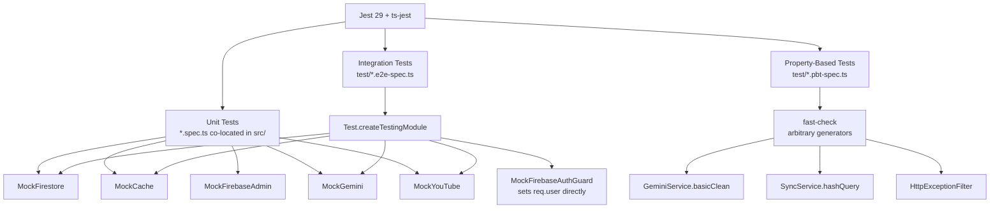

# Design Document: NestJS Music API — Test Suite

## Overview

This document describes the design of a comprehensive test suite for the NestJS Music API. The suite is test-only — no application code is modified. It covers all modules (Auth, Firestore, Songs, Artists, Albums, Playlists, Search, Suggestions, Sync, Common) with three layers:

1. **Unit tests** — each service/guard/filter in isolation, all collaborators replaced by Jest mocks.
2. **Integration tests** — partial NestJS application via `@nestjs/testing` + `supertest`, external services replaced by mock providers.
3. **Property-based tests** — universal invariants verified across many generated inputs using `fast-check`.

The existing toolchain (Jest 29, ts-jest, `@nestjs/testing`, `supertest`, `fast-check`) requires no new dependencies.

---

## Architecture



---

## Components and Interfaces

### Test File Structure

Unit tests live co-located with their source files following NestJS convention. Integration and property-based tests live in a top-level `test/` directory.

```
src/
  songs/
    songs.service.spec.ts          ← Req 1
  artists/
    artists.service.spec.ts        ← Req 2
  albums/
    albums.service.spec.ts         ← Req 3
  playlists/
    playlists.service.spec.ts      ← Req 4
  search/
    search.service.spec.ts         ← Req 5
  suggestions/
    suggestions.service.spec.ts    ← Req 6
  sync/
    gemini.service.spec.ts         ← Req 7
    youtube.service.spec.ts        ← Req 8
    sync.service.spec.ts           ← Req 9
  auth/
    firebase-auth.guard.spec.ts    ← Req 10
    admin.guard.spec.ts            ← Req 11
  common/
    filters/
      http-exception.filter.spec.ts ← Req 12

test/
  shared/
    mock-factories.ts              ← all mock factory functions
    test-app.factory.ts            ← helper to build integration TestingModule
  songs.e2e-spec.ts                ← Req 13
  artists.e2e-spec.ts              ← Req 14
  albums.e2e-spec.ts               ← Req 15
  playlists.e2e-spec.ts            ← Req 16
  search.e2e-spec.ts               ← Req 17
  suggestions.e2e-spec.ts          ← Req 18
  sync.e2e-spec.ts                 ← Req 19
  error-shape.e2e-spec.ts          ← Req 20
  gemini.pbt-spec.ts               ← Req 21
  sync-hash.pbt-spec.ts            ← Req 22
  http-filter.pbt-spec.ts          ← Req 23
```

**Naming conventions:**
- Unit tests: `<subject>.spec.ts` co-located in `src/`
- Integration tests: `<module>.e2e-spec.ts` in `test/`
- Property-based tests: `<subject>.pbt-spec.ts` in `test/`

---

### Shared Test Utilities (`test/shared/mock-factories.ts`)

All mocks are created as factory functions that return fresh Jest mock objects. This prevents state leakage between tests.

#### MockFirestore

Mimics `FirestoreService`. Returns chainable mock objects for `doc()` and `collection()`.

```typescript
export function createMockFirestore() {
  const mockDocRef = {
    get: jest.fn(),
    set: jest.fn(),
    delete: jest.fn(),
    id: 'mock-doc-id',
  };

  const mockQuerySnapshot = {
    docs: [] as any[],
    empty: true,
    size: 0,
  };

  const mockCollectionRef = {
    where: jest.fn().mockReturnThis(),
    orderBy: jest.fn().mockReturnThis(),
    limit: jest.fn().mockReturnThis(),
    get: jest.fn().mockResolvedValue(mockQuerySnapshot),
    add: jest.fn(),
    doc: jest.fn().mockReturnValue(mockDocRef),
  };

  return {
    doc: jest.fn().mockReturnValue(mockDocRef),
    collection: jest.fn().mockReturnValue(mockCollectionRef),
    // Expose internals for per-test configuration
    _docRef: mockDocRef,
    _collectionRef: mockCollectionRef,
    _querySnapshot: mockQuerySnapshot,
  };
}
```

Tests configure return values per scenario:
```typescript
// Cache miss + doc exists
mockFirestore._docRef.get.mockResolvedValue({ exists: true, id: 'song-1', data: () => songData });

// Doc not found
mockFirestore._docRef.get.mockResolvedValue({ exists: false });

// Collection query result
mockFirestore._collectionRef.get.mockResolvedValue({
  docs: [{ id: 'song-1', data: () => songData }],
  empty: false,
  size: 1,
});
```

#### MockCache

Mimics the `CACHE_MANAGER` token interface.

```typescript
export function createMockCache() {
  return {
    get: jest.fn().mockResolvedValue(null),  // default: cache miss
    set: jest.fn().mockResolvedValue(undefined),
    del: jest.fn().mockResolvedValue(undefined),
  };
}
```

#### MockFirebaseAdmin

Mimics `FirebaseAdminService`. The `auth()` method returns an object with a controllable `verifyIdToken`.

```typescript
export function createMockFirebaseAdmin() {
  const mockVerifyIdToken = jest.fn();
  return {
    auth: jest.fn().mockReturnValue({
      verifyIdToken: mockVerifyIdToken,
    }),
    _verifyIdToken: mockVerifyIdToken,  // shortcut for test configuration
  };
}
```

#### MockGemini

Mimics `GeminiService` public interface.

```typescript
export function createMockGemini() {
  return {
    getPopularGenres: jest.fn().mockResolvedValue([]),
    getArtistsForGenre: jest.fn().mockResolvedValue([]),
    generateSearchQueries: jest.fn().mockResolvedValue([]),
    cleanAndDeduplicate: jest.fn().mockResolvedValue([]),
    rankAndDisambiguate: jest.fn().mockResolvedValue(''),
  };
}
```

#### MockYouTube

Mimics `YouTubeService` public interface.

```typescript
export function createMockYouTube() {
  return {
    search: jest.fn().mockResolvedValue([]),
  };
}
```

---

### Integration Test App Factory (`test/shared/test-app.factory.ts`)

Builds a `TestingModule` with all external services replaced by mocks. The `FirebaseAuthGuard` is overridden with a simple guard that reads a `x-test-user` header and sets `req.user` directly — no token verification needed.

```typescript
import { Test, TestingModule } from '@nestjs/testing';
import { INestApplication, ValidationPipe } from '@nestjs/common';
import { HttpExceptionFilter } from '../../src/common/filters/http-exception.filter';
import { AppModule } from '../../src/app.module';
import { FirebaseAuthGuard } from '../../src/auth/firebase-auth.guard';
import { APP_GUARD } from '@nestjs/core';

// Simple guard that bypasses Firebase token verification in tests.
// Tests pass user info via the x-test-user JSON header.
class MockFirebaseAuthGuard {
  canActivate(context: ExecutionContext): boolean {
    const req = context.switchToHttp().getRequest();
    const header = req.headers['x-test-user'];
    if (!header) throw new UnauthorizedException();
    req.user = JSON.parse(header);
    return true;
  }
}

export async function createTestApp(overrides?: {
  firestore?: object;
  cache?: object;
  gemini?: object;
  youtube?: object;
}): Promise<{ app: INestApplication; mocks: Record<string, any> }> {
  const mocks = {
    firestore: overrides?.firestore ?? createMockFirestore(),
    cache: overrides?.cache ?? createMockCache(),
    gemini: overrides?.gemini ?? createMockGemini(),
    youtube: overrides?.youtube ?? createMockYouTube(),
  };

  const moduleRef: TestingModule = await Test.createTestingModule({
    imports: [AppModule],
  })
    .overrideProvider(FirestoreService).useValue(mocks.firestore)
    .overrideProvider(CACHE_MANAGER).useValue(mocks.cache)
    .overrideProvider(GeminiService).useValue(mocks.gemini)
    .overrideProvider(YouTubeService).useValue(mocks.youtube)
    .overrideGuard(FirebaseAuthGuard).useClass(MockFirebaseAuthGuard)
    .compile();

  const app = moduleRef.createNestApplication();
  app.useGlobalPipes(new ValidationPipe({ whitelist: true, transform: true }));
  app.useGlobalFilters(new HttpExceptionFilter());
  await app.init();

  return { app, mocks };
}
```

**Sending authenticated requests in integration tests:**
```typescript
// Regular user
request(app.getHttpServer())
  .get('/songs/song-1')
  .set('x-test-user', JSON.stringify({ uid: 'user-1', email: 'user@test.com', admin: false }))

// Admin user
request(app.getHttpServer())
  .post('/sync/trigger')
  .set('x-test-user', JSON.stringify({ uid: 'admin-1', email: 'admin@test.com', admin: true }))

// Unauthenticated (no header → MockFirebaseAuthGuard throws 401)
request(app.getHttpServer()).get('/songs/song-1')
```

**Note on AdminGuard in integration tests:** `AdminGuard` extends `FirebaseAuthGuard`. Since `FirebaseAuthGuard` is overridden globally, `AdminGuard` must also be overridden or the `APP_GUARD` approach used. The factory overrides `FirebaseAuthGuard` at the guard level; `AdminGuard` is overridden separately to check `req.user.admin` from the already-set user object (no token verification).

---

## Data Models

### Mock Document Factories

Helper functions in `test/shared/mock-factories.ts` produce typed Firestore document shapes for use across all tests.

```typescript
export function makeSongDoc(overrides?: Partial<SongDocument>) {
  return {
    id: 'song-1',
    exists: true,
    data: () => ({
      title: 'Test Song',
      durationSeconds: 180,
      coverImageUrl: null,
      youtubeId: 'yt-abc',
      youtubeIdPendingReview: false,
      artistId: 'artist-1',
      albumId: null,
      genre: 'Rock',
      createdAt: { toDate: () => new Date() },
      updatedAt: { toDate: () => new Date() },
      ...overrides,
    }),
  };
}

export function makeArtistDoc(overrides?: Partial<ArtistDocument>) { /* ... */ }
export function makeAlbumDoc(overrides?: Partial<AlbumDocument>) { /* ... */ }
export function makePlaylistDoc(overrides?: Partial<PlaylistDocument>) { /* ... */ }

export function makeRawYouTubeResult(overrides?: Partial<RawYouTubeResult>): RawYouTubeResult {
  return {
    videoId: 'yt-' + Math.random().toString(36).slice(2),
    title: 'Song Title',
    channelTitle: 'Artist Channel',
    genre: 'Rock',
    artistRank: 1,
    artistName: 'Test Artist',
    durationSeconds: 200,
    ...overrides,
  };
}
```

### fast-check Arbitraries

Defined in `test/shared/arbitraries.ts` for reuse across PBT files.

```typescript
import * as fc from 'fast-check';

// Arbitrary RawYouTubeResult
export const arbRawYouTubeResult = fc.record({
  videoId: fc.hexaString({ minLength: 5, maxLength: 11 }),
  title: fc.string({ minLength: 1, maxLength: 100 }),
  channelTitle: fc.string({ minLength: 1, maxLength: 50 }),
  genre: fc.constantFrom('Rock', 'Pop', 'Jazz', 'Hip-Hop', 'Classical'),
  artistRank: fc.integer({ min: 1, max: 10 }),
  artistName: fc.string({ minLength: 1, maxLength: 50 }),
  durationSeconds: fc.option(fc.integer({ min: 1, max: 600 })),
});

// Array of RawYouTubeResult (non-empty)
export const arbRawYouTubeResultArray = fc.array(arbRawYouTubeResult, { minLength: 1, maxLength: 50 });

// Non-empty string (for hashQuery tests)
export const arbNonEmptyString = fc.string({ minLength: 1, maxLength: 200 });

// HTTP status code in 4xx-5xx range
export const arbHttpStatusCode = fc.integer({ min: 400, max: 599 });

// Arbitrary message string
export const arbMessageString = fc.string({ minLength: 0, maxLength: 200 });
```

---

## Unit Test Design

### SongsService (`src/songs/songs.service.spec.ts`)

**Setup:**
```typescript
let service: SongsService;
let mockFirestore: ReturnType<typeof createMockFirestore>;
let mockCache: ReturnType<typeof createMockCache>;

beforeEach(async () => {
  mockFirestore = createMockFirestore();
  mockCache = createMockCache();
  const module = await Test.createTestingModule({
    providers: [
      SongsService,
      { provide: FirestoreService, useValue: mockFirestore },
      { provide: CACHE_MANAGER, useValue: mockCache },
    ],
  }).compile();
  service = module.get(SongsService);
});
```

**Test cases (Req 1):**
- `findById` — cache hit: `mockCache.get` returns cached DTO → assert return value equals cached, `mockFirestore.doc().get` not called.
- `findById` — cache miss + doc exists: `mockCache.get` returns null, `mockFirestore._docRef.get` returns `makeSongDoc()` → assert DTO fields mapped correctly, `mockCache.set` called with TTL 300_000.
- `findById` — doc not found: `mockFirestore._docRef.get` returns `{ exists: false }` → assert `NotFoundException` thrown with message `'Song not found'`.
- `findAll` — valid pagination: mock collection chain returns 4 docs → assert `orderBy`, `limit` called, result is array of `SongResponseDto`.
- `findAll` — page 2, pageSize 2: mock returns 4 docs → assert slice returns docs at index 2 and 3.

### ArtistsService (`src/artists/artists.service.spec.ts`)

**Test cases (Req 2):**
- `findById` — cache hit: cached value returned, Firestore not called.
- `findById` — doc not found: `NotFoundException` with `'Artist not found'`.
- `findSongs` — valid artistId: collection query with `where('artistId', '==', artistId)` called, results mapped to `SongResponseDto[]`.
- `findAlbums` — valid artistId: collection query with `where('artistId', '==', artistId)` called, results mapped to `AlbumResponseDto[]`.
- `findById` — cache miss: `mockCache.set` called with TTL 300_000.

### AlbumsService (`src/albums/albums.service.spec.ts`)

**Test cases (Req 3):**
- `findById` — cache hit: cached value returned.
- `findById` — doc not found: `NotFoundException` with `'Album not found'`.
- `findAll` — default pagination (page=1, pageSize=20): `limit(20)` called on Firestore query.
- `findById` — cache miss: result stored in cache, DTO contains `id`, `title`, `releaseYear`, `coverImageUrl`, `artistId`.

### PlaylistsService (`src/playlists/playlists.service.spec.ts`)

**Test cases (Req 4):**
- `create` — valid input: Firestore `collection('playlists').add()` called with `ownerUid` = caller UID and `type = 'user'`.
- `findAllForUser` — queries with `where('ownerUid', '==', ownerUid)`.
- `addSong` — playlist not found: `NotFoundException`.
- `addSong` — wrong owner: `ForbiddenException`.
- `addSong` — song not found: `NotFoundException` with `'Song not found'`.
- `removeSong` — wrong owner: `ForbiddenException`.
- `delete` — owner: `doc('playlists/{id}').delete()` called.
- `delete` — non-owner: `ForbiddenException`.

### SearchService (`src/search/search.service.spec.ts`)

**Test cases (Req 5):**
- `search('')` — `BadRequestException` thrown.
- `search('   ')` — `BadRequestException` thrown.
- `search('rock')` — cache hit: cached result returned, Firestore not called.
- `search('rock')` — cache miss: four collection queries executed (songs, artists, albums, playlists), results merged and `mockCache.set` called.
- Result shape: returned object has exactly keys `songs`, `artists`, `albums`, `playlists`, each an array.
- Playlist filtering: docs with `ownerUid === null` excluded from playlist results.

### SuggestionsService (`src/suggestions/suggestions.service.spec.ts`)

**Test cases (Req 6):**
- `suggest('r')` — `BadRequestException` (length < 2).
- `suggest('ro')` — no exception, Firestore queries executed.
- `suggest('rock')` — cache hit: cached result returned.
- Ordering: when mock returns both prefix and substring matches, prefix matches appear first in output array.
- Count cap: when mock returns > 10 docs total, output length is exactly 10.
- Playlist filtering: docs with `ownerUid === null` excluded.

### GeminiService (`src/sync/gemini.service.spec.ts`)

**Setup:** Instantiate `GeminiService` directly (no DI needed). Mock `GoogleGenerativeAI` via `jest.mock('@google/generative-ai')`.

**Test cases (Req 7):**
- `getPopularGenres` — model returns valid JSON array: parsed array returned.
- `getPopularGenres` — model throws: default genre list returned, no re-throw.
- `getArtistsForGenre` — model returns artists with duplicate ranks: only first occurrence of each rank kept.
- `generateSearchQueries` — with artistName and topSongs: non-empty array of non-empty strings returned.
- `generateSearchQueries` — no API key (GEMINI_API_KEY unset): default queries returned containing artist name.
- `cleanAndDeduplicate([])` — empty array: returns `[]` without calling model.
- `cleanAndDeduplicate` — model unavailable: `basicClean` fallback used, duplicate title+artist entries merged.
- `rankAndDisambiguate` — single result: returns that result's `videoId` without calling model.
- `rankAndDisambiguate` — model returns unknown videoId: first result's `videoId` returned as fallback.

### YouTubeService (`src/sync/youtube.service.spec.ts`)

**Setup:** Mock `axios` via `jest.mock('axios')`.

**Test cases (Req 8):**
- No API key: returns `[]`, no HTTP calls made.
- Search returns items: second HTTP call made to videos endpoint for durations.
- Videos endpoint throws: results still returned (best-effort), no exception propagated.
- Search returns empty items: returns `[]`.
- Search API throws: returns `[]`, no re-throw.
- Duration parsing: `'PT1H2M3S'` → 3723, `'PT30S'` → 30, `''` → 0.

### SyncService (`src/sync/sync.service.spec.ts`)

**Setup:** Inject `MockFirestore`, `MockGemini`, `MockYouTube`.

**Test cases (Req 9):**
- `runSync({ genres: [] })` — `mockGemini.getPopularGenres` called once, its return used as genre list.
- `runSync({ genres: ['Rock'] })` — `mockGemini.getPopularGenres` NOT called.
- `runSync({ force: false })` — syncCache doc exists: `mockYouTube.search` NOT called for that query.
- `runSync({ force: true })` — `mockYouTube.search` called for every query regardless of cache.
- Deduplication: existing song (same title + artistName) in Firestore → no new doc created.
- New song: `collection('songs').doc().set()` called with `youtubeId`, `genre`, `artistId`.
- Error on single song: processing continues for remaining songs, error logged.
- Genre playlists: upserted for each input genre, songs added to correct playlist.
- Album playlists: upserted for each album with resolved songs.
- Duplicate playlist songs: songs already in playlist subcollection not added again.

### FirebaseAuthGuard (`src/auth/firebase-auth.guard.spec.ts`)

**Setup:** Instantiate guard with `MockFirebaseAdmin`.

**Test cases (Req 10):**
- Valid Bearer token, `verifyIdToken` resolves: `canActivate` returns `true`, `req.user` has `uid`, `email`, `admin`.
- No Authorization header: `UnauthorizedException` thrown.
- Header not starting with `'Bearer '`: `UnauthorizedException` thrown.
- `verifyIdToken` throws: `UnauthorizedException` thrown.
- Token with `admin: true` claim: `req.user.admin === true`.
- Token without `admin` field: `req.user.admin === false`.

### AdminGuard (`src/auth/admin.guard.spec.ts`)

**Setup:** Instantiate `AdminGuard` with `MockFirebaseAdmin`. Spy on `super.canActivate`.

**Test cases (Req 11):**
- Valid token + `req.user.admin === true`: `canActivate` returns `true`.
- Valid token + `req.user.admin === false`: `ForbiddenException` with `'Admin access required'`.
- Invalid token (parent throws `UnauthorizedException`): `UnauthorizedException` propagated before admin check.

### HttpExceptionFilter (`src/common/filters/http-exception.filter.spec.ts`)

**Setup:** Instantiate filter directly. Build mock `ArgumentsHost` with controllable `response.status().json()` and `request.url`.

**Test cases (Req 12):**
- `HttpException` (e.g. `NotFoundException`): response JSON has `statusCode` matching exception status, `message`, `timestamp`.
- Non-`HttpException` error: response JSON has `statusCode: 500`, `message: 'Internal server error'`.
- `BadRequestException` with message array: `message` field in response is that array.
- `timestamp` field: valid ISO 8601 string (`new Date(timestamp)` is not NaN).
- `path` field: matches `request.url`.

---

## Integration Test Design

All integration tests use `createTestApp()` from `test/shared/test-app.factory.ts`. Each test file creates the app in `beforeAll`, closes it in `afterAll`, and resets mock return values in `beforeEach`.

### Songs Endpoints (`test/songs.e2e-spec.ts`) — Req 13

```
GET /songs/:id
  ✓ 200 with full DTO when song exists (auth header set)
  ✓ 404 with { statusCode, message, timestamp } when song not found
  ✓ 401 when no auth header

GET /songs?page=1&pageSize=5
  ✓ 200 with array body
  ✓ 200 with defaults when no pagination params
```

### Artists Endpoints (`test/artists.e2e-spec.ts`) — Req 14

```
GET /artists/:id
  ✓ 200 with { id, name, biography, profileImageUrl }
  ✓ 404 when artist not found
  ✓ 401 without auth

GET /artists/:id/songs  → 200 array
GET /artists/:id/albums → 200 array
```

### Albums Endpoints (`test/albums.e2e-spec.ts`) — Req 15

```
GET /albums/:id
  ✓ 200 with { id, title, releaseYear, coverImageUrl, artistId }
  ✓ 404 when not found
  ✓ 401 without auth

GET /albums → 200 array
```

### Playlists Endpoints (`test/playlists.e2e-spec.ts`) — Req 16

```
POST /playlists
  ✓ 201 with ownerUid matching authenticated user's UID

GET /playlists
  ✓ 200 array of playlists owned by authenticated user

POST /playlists/:id/songs
  ✓ 403 when caller is not owner
  ✓ 404 when songId does not exist

DELETE /playlists/:id
  ✓ 204 when called by owner
  ✓ 403 when called by non-owner

DELETE /playlists/:id/songs/:songId
  ✓ 204 when called by owner

Any endpoint without auth → 401
```

### Search Endpoint (`test/search.e2e-spec.ts`) — Req 17

```
GET /search?q=rock
  ✓ 200 with body containing exactly keys: songs, artists, albums, playlists

GET /search?q=
  ✓ 400

GET /search (no q param)
  ✓ 400

GET /search?q=rock without auth
  ✓ 401
```

### Suggestions Endpoint (`test/suggestions.e2e-spec.ts`) — Req 18

```
GET /suggestions?q=ro
  ✓ 200 with array of at most 10 items

GET /suggestions?q=r
  ✓ 400

GET /suggestions?q=rock
  ✓ 200 with items containing { id, name, type }

GET /suggestions?q=rock without auth
  ✓ 401
```

### Sync Trigger Endpoint (`test/sync.e2e-spec.ts`) — Req 19

```
POST /sync/trigger (admin user)
  ✓ 202 with { message: 'Sync triggered' }

POST /sync/trigger (non-admin user)
  ✓ 403

POST /sync/trigger (no auth)
  ✓ 401

POST /sync/trigger { genres: ['Rock'], force: true }
  ✓ mockSyncService.runSync called with { genres: ['Rock'], force: true }

POST /sync/trigger {} (empty body)
  ✓ mockSyncService.runSync called with default DTO values
```

**Note on AdminGuard in integration tests:** `SyncService` is overridden with a mock. `AdminGuard` is overridden to check `req.user.admin` (already set by `MockFirebaseAuthGuard`) without calling `super.canActivate`.

### Error Response Shape (`test/error-shape.e2e-spec.ts`) — Req 20

Sends requests designed to trigger each error type across multiple endpoints and asserts the response body shape:

```typescript
// For each error response collected:
expect(body.statusCode).toEqual(expect.any(Number));
expect(body.message).toBeDefined();
expect(new Date(body.timestamp).toString()).not.toBe('Invalid Date');
```

Specific cases:
- 400 from validation (missing required field): `message` is `string[]`.
- 500 from unhandled exception (mock throws non-HttpException): `statusCode: 500`, `message: 'Internal server error'`.

---

## Correctness Properties

*A property is a characteristic or behavior that should hold true across all valid executions of a system — essentially, a formal statement about what the system should do. Properties serve as the bridge between human-readable specifications and machine-verifiable correctness guarantees.*

### Property 1: basicClean deduplication — no duplicates and output never grows

*For any* non-empty array of `RawYouTubeResult` objects, the output of `GeminiService.basicClean` SHALL contain no two entries with the same normalized `title.toLowerCase() + '|' + artistName.toLowerCase()` key, and the output length SHALL be less than or equal to the input length.

**Validates: Requirements 21.1, 21.2**

---

### Property 2: basicClean no over-deduplication

*For any* array of `RawYouTubeResult` objects where all entries already have distinct normalized `title.toLowerCase() + '|' + artistName.toLowerCase()` keys, the output length of `basicClean` SHALL equal the input length — no entries are incorrectly merged.

**Validates: Requirements 21.3**

---

### Property 3: hashQuery determinism

*For any* non-empty string `q`, calling `SyncService.hashQuery(q)` twice SHALL return the same value both times.

**Validates: Requirements 22.1**

---

### Property 4: hashQuery case-insensitivity

*For any* non-empty string `q`, `hashQuery(q.trim().toLowerCase())` SHALL equal `hashQuery(q.trim().toUpperCase())` — the implementation normalizes to lowercase before hashing, so case differences in the input do not produce different hashes.

**Validates: Requirements 22.2**

---

### Property 5: hashQuery whitespace trimming

*For any* non-empty string `q`, `hashQuery('  ' + q.trim() + '  ')` SHALL equal `hashQuery(q.trim())` — leading and trailing whitespace is stripped before hashing.

**Validates: Requirements 22.3**

---

### Property 6: HttpExceptionFilter response shape, statusCode round-trip, and timestamp validity

*For any* HTTP status code in the range 400–599 and any message string, `HttpExceptionFilter` SHALL produce a response JSON body that: (a) contains the fields `statusCode`, `message`, and `timestamp`; (b) has `statusCode` equal to the input HTTP status code; and (c) has `timestamp` parseable as a valid ISO 8601 date string (`new Date(timestamp)` is not `Invalid Date`).

**Validates: Requirements 23.1, 23.2, 23.3**

---

### Property 7: Whitespace-only search queries are always rejected

*For any* string composed entirely of whitespace characters (spaces, tabs, newlines), calling `SearchService.search` with that string SHALL throw a `BadRequestException`.

**Validates: Requirements 5.2**

---

### Property 8: Short suggestion queries are always rejected

*For any* string of length 0 or 1, calling `SuggestionsService.suggest` with that string SHALL throw a `BadRequestException`.

**Validates: Requirements 6.1**

---

### Property 9: Suggestion result count upper bound

*For any* Firestore mock configuration that returns an arbitrary number of matching documents, `SuggestionsService.suggest` SHALL return an array of at most 10 items.

**Validates: Requirements 6.5**

---

### Property 10: GeminiArtistResult ranks are unique after deduplication

*For any* array of `GeminiArtistResult` objects with arbitrary (possibly duplicate) rank values, the output of `GeminiService.getArtistsForGenre`'s internal deduplication logic SHALL contain at most one entry per rank value — no two entries in the output share the same `rank`.

**Validates: Requirements 7.3**

---

## Error Handling

### Unit Test Error Paths

Each service test explicitly covers:
- `NotFoundException` — document does not exist in Firestore.
- `ForbiddenException` — ownership mismatch in `PlaylistsService`.
- `BadRequestException` — empty/whitespace query in `SearchService` and `SuggestionsService`.
- `UnauthorizedException` — missing/invalid token in `FirebaseAuthGuard`.

### Integration Test Error Paths

The `HttpExceptionFilter` is registered globally in `createTestApp()`. All integration tests that expect error responses assert the full `{ statusCode, message, timestamp, path }` shape.

### Mock Error Injection

To test error propagation, mocks throw directly:
```typescript
mockFirestore._docRef.get.mockRejectedValue(new Error('Firestore unavailable'));
```

For `SyncService` error-resilience tests, individual song persistence is made to throw while other songs succeed:
```typescript
mockFirestore.collection().doc().set
  .mockRejectedValueOnce(new Error('write failed'))
  .mockResolvedValue(undefined);
```

---

## Testing Strategy

### Unit Tests

- Use `@nestjs/testing` `Test.createTestingModule` with mock providers.
- Each `describe` block covers one class; each `it` covers one acceptance criterion.
- `beforeEach` creates fresh mocks to prevent state leakage.
- Assert both the return value and the mock call signatures (arguments, call count).
- Avoid testing implementation details beyond what the acceptance criteria require.

### Integration Tests

- Use `createTestApp()` factory; one `INestApplication` per test file (created in `beforeAll`).
- Use `supertest` for HTTP assertions.
- Reset mock return values in `beforeEach` to defaults; configure per-test overrides inline.
- Assert HTTP status codes, response body shape, and key field values.
- Do not assert internal mock call counts in integration tests — that is the unit test's job.

### Property-Based Tests

- Use `fast-check` v3 (already in `devDependencies`).
- Each property test runs a minimum of **100 iterations** (`numRuns: 100` in `fc.assert`).
- Each property test is tagged with a comment referencing the design property:
  ```typescript
  // Feature: nestjs-project-tests, Property 1: basicClean deduplication
  ```
- `GeminiService.basicClean` is tested by accessing the private method via `(service as any).basicClean(input)`.
- `SyncService.hashQuery` is tested by accessing the private method via `(service as any).hashQuery(input)`.
- `HttpExceptionFilter` is tested by instantiating it directly and building a mock `ArgumentsHost`.

### Jest Configuration

The existing `jest` config in `package.json` covers `src/**/*.spec.ts`. Integration and PBT tests in `test/` require a separate Jest project config:

```json
// jest.config.js (root)
module.exports = {
  projects: [
    {
      displayName: 'unit',
      testMatch: ['<rootDir>/src/**/*.spec.ts'],
      transform: { '^.+\\.ts$': 'ts-jest' },
      testEnvironment: 'node',
      moduleFileExtensions: ['js', 'json', 'ts'],
    },
    {
      displayName: 'integration',
      testMatch: ['<rootDir>/test/**/*.e2e-spec.ts'],
      transform: { '^.+\\.ts$': 'ts-jest' },
      testEnvironment: 'node',
      moduleFileExtensions: ['js', 'json', 'ts'],
      moduleNameMapper: { '^src/(.*)$': '<rootDir>/src/$1' },
    },
    {
      displayName: 'pbt',
      testMatch: ['<rootDir>/test/**/*.pbt-spec.ts'],
      transform: { '^.+\\.ts$': 'ts-jest' },
      testEnvironment: 'node',
      moduleFileExtensions: ['js', 'json', 'ts'],
      moduleNameMapper: { '^src/(.*)$': '<rootDir>/src/$1' },
    },
  ],
};
```

Update `package.json` scripts:
```json
"test:unit": "jest --selectProjects unit --runInBand",
"test:integration": "jest --selectProjects integration --runInBand",
"test:pbt": "jest --selectProjects pbt --runInBand",
"test:all": "jest --runInBand"
```

`--runInBand` is used for integration tests to avoid port conflicts between parallel test workers.

### Coverage

Run `jest --coverage` to collect coverage across all projects. Target: ≥ 80% line coverage on all service and guard files.
