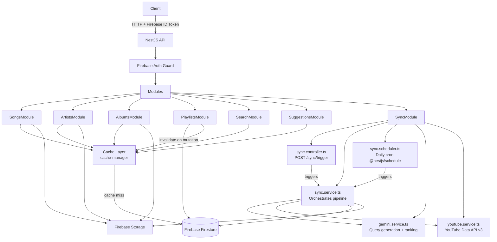
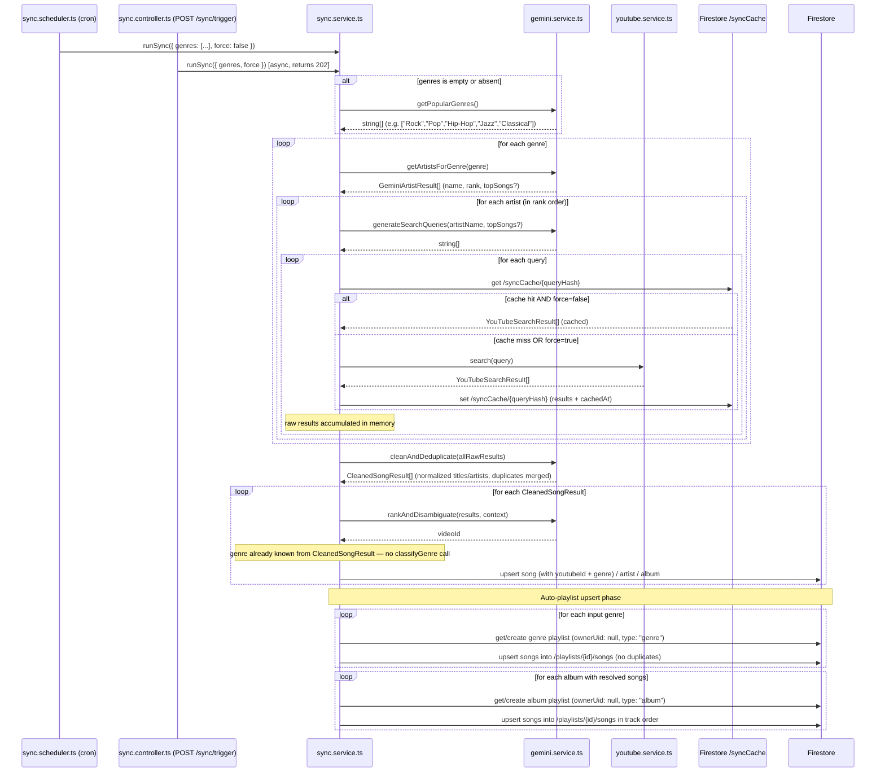
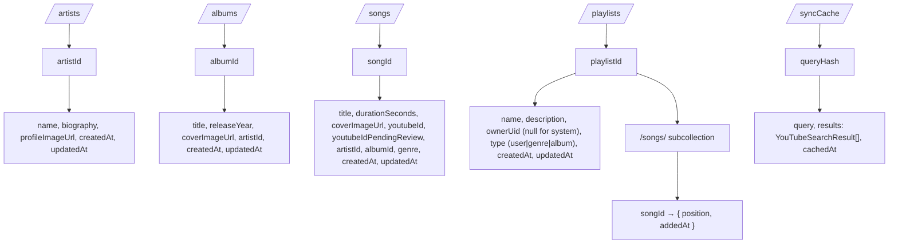

# Design Document: NestJS Music API

## Overview

The NestJS Music API is a RESTful backend service for a music application. It exposes endpoints for searching, browsing, and managing music entities (songs, artists, albums, playlists). Firebase Authentication secures all protected routes. YouTube video IDs are stored per song so clients can construct playback URLs. A `sync` NestJS module populates and refreshes Firestore data by using Gemini AI to generate YouTube search queries, executing those queries against the YouTube Data API v3, ranking and disambiguating results via Gemini, and persisting the resolved data. The sync runs on a daily cron schedule and can also be triggered manually via a protected admin endpoint.

### Key Design Decisions

- **NestJS** as the framework — provides a modular, opinionated structure with built-in support for guards, interceptors, pipes, and dependency injection.
- **Firebase Admin SDK** for token verification — stateless JWT-style auth without managing sessions.
- **Firebase Firestore** as the persistence layer — document/collection model accessed via the Firebase Admin SDK; no SQL or ORM required.
- **Firebase Storage** for cover images — consistent media URLs across all entity types.
- **Gemini AI** for search query generation, YouTube result ranking, and duplicate disambiguation — offloads query formulation and ranking logic to an LLM with structured prompts.
- **YouTube Data API v3** for video search during the sync pipeline.
- **`@nestjs/schedule`** for the daily cron-based sync job — keeps scheduling inside the NestJS process with no external scheduler required.

---

## Architecture



### Request Lifecycle

1. Client sends HTTP request with `Authorization: Bearer <firebase-id-token>`.
2. `FirebaseAuthGuard` verifies the token via Firebase Admin SDK.
3. Request is routed to the appropriate controller.
4. Controller delegates to a service, which reads/writes Firestore documents via `FirestoreService`.
5. Response is serialized and returned. Errors are caught by a global exception filter.

---

## Components and Interfaces

### Module Structure

```
src/
  auth/
    firebase-auth.guard.ts
    firebase-admin.service.ts
  songs/
    songs.controller.ts
    songs.service.ts
    dto/
  artists/
    artists.controller.ts
    artists.service.ts
    dto/
  albums/
    albums.controller.ts
    albums.service.ts
    dto/
  playlists/
    playlists.controller.ts
    playlists.service.ts
    dto/
  search/
    search.controller.ts
    search.service.ts
  suggestions/
    suggestions.controller.ts
    suggestions.service.ts
  sync/
    sync.module.ts
    sync.controller.ts      ← POST /sync/trigger (admin-protected)
    sync.service.ts         ← orchestrates the full sync pipeline
    sync.scheduler.ts       ← daily cron job via @nestjs/schedule
    gemini.service.ts       ← generates search queries + ranks/disambiguates results
    youtube.service.ts      ← executes YouTube Data API v3 searches
  storage/
    firebase-storage.service.ts
  firestore/
    firestore.service.ts
    firestore.module.ts
  cache/
    cache.module.ts          ← registers CacheModule with store config
    cache-keys.ts            ← centralised key-builder helpers
  common/
    filters/
      http-exception.filter.ts
    interceptors/
    pipes/
      validation.pipe.ts
    dto/
      error-response.dto.ts
  app.module.ts
  main.ts
```

### Key Interfaces

```typescript
// Auth
interface AuthenticatedRequest extends Request {
  user: { uid: string; email: string };
}

// Search
interface SearchResults {
  songs: SongSummary[];
  artists: ArtistSummary[];
  albums: AlbumSummary[];
  playlists: PlaylistSummary[];
}

// Suggestions
interface SuggestionResult {
  id: string;
  name: string;
  type: 'song' | 'artist' | 'album' | 'playlist';
}

// Sync trigger request body
interface SyncRequestDto {
  genres?: string[];   // optional; defaults to [] which triggers auto-discovery via getPopularGenres()
  force?: boolean;     // optional; defaults to false
}

// Gemini artist discovery result
interface GeminiArtistResult {
  name: string;         // artist name
  rank: number;         // relevance/popularity rank within the genre (1 = most relevant)
  topSongs?: string[];  // optional list of suggested top song titles for this artist
  // Note: GeminiService.getPopularGenres() returns string[] (list of genre name strings)
}

// Cleaned, deduplicated song result produced by GeminiService.cleanAndDeduplicate()
interface CleanedSongResult {
  title: string;           // normalized song title (noise suffixes removed, casing fixed)
  artistName: string;      // normalized artist name (consistent casing, featuring info removed)
  albumName?: string;      // optional album name
  genre: string;           // genre from the input that triggered discovery (non-empty)
  artistRank: number;      // rank inherited from the artist's rank within its genre (positive integer)
  youtubeId: string;       // best YouTube video ID selected from merged duplicates
  durationSeconds?: number; // optional duration in seconds
}

// Error Response
interface ErrorResponse {
  statusCode: number;
  message: string | string[];
  timestamp: string;
}
```

### REST Endpoints

| Method | Path | Auth | Description |
|--------|------|------|-------------|
| GET | `/search?q=` | ✓ | Search all entity types |
| GET | `/suggestions?q=` | ✓ | Get search suggestions |
| GET | `/songs` | ✓ | List songs (paginated) |
| GET | `/songs/:id` | ✓ | Get song by ID |
| GET | `/artists` | ✓ | List artists (paginated) |
| GET | `/artists/:id` | ✓ | Get artist by ID |
| GET | `/artists/:id/songs` | ✓ | List artist's songs |
| GET | `/artists/:id/albums` | ✓ | List artist's albums |
| GET | `/albums` | ✓ | List albums (paginated) |
| GET | `/albums/:id` | ✓ | Get album by ID |
| GET | `/playlists` | ✓ | List current user's playlists |
| POST | `/playlists` | ✓ | Create playlist |
| DELETE | `/playlists/:id` | ✓ | Delete playlist |
| POST | `/playlists/:id/songs` | ✓ | Add song to playlist |
| DELETE | `/playlists/:id/songs/:songId` | ✓ | Remove song from playlist |
| POST | `/sync/trigger` | ✓ (admin) | Manually trigger the sync pipeline; accepts JSON body `{ genres[], force }` |

---

## Sync Pipeline

The sync pipeline is orchestrated by `SyncService` and follows these steps:

1. **Input** — The pipeline receives a `SyncRequestDto` containing an optional `genres` array and an optional `force` flag. Both the manual trigger endpoint and the scheduled job supply this input; the scheduler uses a configured default genre list (which may be empty to trigger auto-discovery).

2. **Auto Genre Discovery** — If the `genres` array is empty or absent, `GeminiService.getPopularGenres()` is called at the very beginning of the pipeline. It returns a `string[]` of popular music genres (e.g. "Rock", "Pop", "Hip-Hop", "Jazz", "Classical"). The returned list is used as the effective genre input for all subsequent steps — identical to the behaviour when genres are supplied manually by the caller.

3. **Artist Discovery** — For each genre in the effective genre list, `GeminiService.getArtistsForGenre(genre)` sends a structured prompt to Gemini AI and returns a ranked list of `GeminiArtistResult` objects (`{ name, rank, topSongs? }`). Artists are processed in rank order (rank 1 first).

4. **Query Generation** — For each discovered artist, `GeminiService.generateSearchQueries(artistName)` generates YouTube search query strings. If `topSongs` were returned for the artist, additional per-song queries are generated using the song titles (e.g. `"<artist> <songTitle>"`).

5. **Cache Check** — For each generated query, `SyncService` computes a SHA-256 hash of the normalized query string and checks `/syncCache/{queryHash}` in Firestore. If a cached document exists **and** the sync is not running in force mode, the stored `results` are reused and the YouTube Data API is **not** called for that query.

6. **YouTube Search** — If no cached result exists (or `force=true`), `YouTubeService.search(query)` calls the YouTube Data API v3 and returns a list of `YouTubeSearchResult` objects (videoId, title, channelTitle, duration). The results are immediately written to `/syncCache/{queryHash}` for future runs.

7. **Gemini Data Cleaning Pass** — After all YouTube searches are completed for all artists across all genres, `GeminiService.cleanAndDeduplicate(rawResults)` is called with the full batch of collected raw results. Gemini returns a `CleanedSongResult[]` where: song titles are normalized (noise suffixes like "(Official Video)", "(Lyrics)", "(ft. ...)" removed, casing fixed); artist names are normalized (consistent casing, featuring info removed from the artist field); duplicate songs (same normalized title + normalized artist, different YouTube results) are merged into a single entry with the best YouTube result selected; each entry carries the `genre` from the input genre that triggered discovery and the `artistRank` inherited from the artist's rank within its genre. All subsequent steps operate on `CleanedSongResult` objects.

8. **Ranking & Disambiguation** — `GeminiService.rankAndDisambiguate(results, context)` sends the candidate results to Gemini with the song's known metadata. Gemini returns the single best-matching `videoId`. If Gemini is unavailable, the first result is used as a fallback. (For entries already merged by the cleaning pass, this step confirms or refines the selected `youtubeId`.)

9. **Genre Classification** — Because the genre is already known from the input (step 2/3) and is carried on each `CleanedSongResult`, no additional Gemini genre classification call is needed.

10. **Deduplication** — Before writing to Firestore, `SyncService` checks whether a document with the same name + artist combination already exists. Existing documents are skipped (upsert-safe).

11. **Persistence** — Resolved songs (with `youtubeId` and `genre`), artists, and albums are written to Firestore. Cover images are stored in Firebase Storage and the URL is saved on the document.

12. **Auto-Playlist Creation** — After all songs for a batch are persisted, `SyncService` runs the playlist upsert step:
   - **Genre playlists**: For each input genre, `SyncService` looks up or creates a `/playlists/{id}` document with `ownerUid: null` and `type: 'genre'`. Each song discovered via that genre is added to its genre playlist's `/songs` subcollection if not already present.
   - **Album playlists**: For each album that had songs resolved in this run, `SyncService` looks up or creates a `/playlists/{id}` document with `ownerUid: null` and `type: 'album'`. Songs are upserted into the subcollection in track order (by `position`).

13. **Error Handling** — Errors on individual records are caught, logged, and processing continues. A sync-level summary (records processed, skipped, failed) is logged on completion.

### Sync Trigger Paths



### Admin Guard

`POST /sync/trigger` uses a dedicated `AdminGuard` that extends `FirebaseAuthGuard`. After token verification it checks for an `admin: true` custom claim on the decoded Firebase token. Requests without the claim receive HTTP 403.

```typescript
@Injectable()
export class AdminGuard extends FirebaseAuthGuard {
  canActivate(context: ExecutionContext): boolean | Promise<boolean> {
    const req = context.switchToHttp().getRequest<AuthenticatedRequest>();
    return super.canActivate(context) && req.user?.admin === true;
  }
}
```

---

## Data Models

### Firestore Collection Structure

All data is stored in Firebase Firestore using the following top-level collections. Document IDs are auto-generated Firestore IDs (strings).

```
/artists/{artistId}
/albums/{albumId}
/songs/{songId}
/playlists/{playlistId}
/playlists/{playlistId}/songs/{songId}   ← subcollection
/syncCache/{queryHash}                   ← processed search query cache
```

> **System-generated playlists**: Genre playlists and album playlists created by the sync pipeline have `ownerUid: null` and a `type` field (`"genre"` or `"album"`). They are excluded from user playlist listings (which filter on `ownerUid == currentUser.uid`) and cannot be mutated by regular users.

### Collection Diagrams



### Document Shapes (TypeScript interfaces)

```typescript
// /artists/{artistId}
interface ArtistDocument {
  name: string;
  biography: string;
  profileImageUrl: string | null;
  createdAt: FirebaseFirestore.Timestamp;
  updatedAt: FirebaseFirestore.Timestamp;
}

// /albums/{albumId}
interface AlbumDocument {
  title: string;
  releaseYear: number;
  coverImageUrl: string | null;
  artistId: string;
  createdAt: FirebaseFirestore.Timestamp;
  updatedAt: FirebaseFirestore.Timestamp;
}

// /songs/{songId}
interface SongDocument {
  title: string;
  durationSeconds: number;
  coverImageUrl: string | null;
  youtubeId: string | null;
  youtubeIdPendingReview: boolean;
  artistId: string;
  albumId: string | null;
  genre: string | null;              // e.g. "Rock", "Pop" — set by Gemini during sync
  createdAt: FirebaseFirestore.Timestamp;
  updatedAt: FirebaseFirestore.Timestamp;
}

// /playlists/{playlistId}
interface PlaylistDocument {
  name: string;
  description: string | null;
  ownerUid: string | null;  // Firebase Auth UID for user playlists; null for system-generated playlists
  type: 'user' | 'genre' | 'album';  // 'genre' and 'album' are system-generated by sync
  createdAt: FirebaseFirestore.Timestamp;
  updatedAt: FirebaseFirestore.Timestamp;
}

// /playlists/{playlistId}/songs/{songId}
interface PlaylistSongDocument {
  position: number;
  addedAt: FirebaseFirestore.Timestamp;
}

// /syncCache/{queryHash}
// queryHash = SHA-256 hex digest of the normalized query string
interface SyncCacheDocument {
  query: string;                          // original query string
  results: YouTubeSearchResult[];         // raw results returned by YouTube Data API
  cachedAt: FirebaseFirestore.Timestamp;  // when the result was stored
}
```

### FirestoreService

A shared `FirestoreService` wraps the Firebase Admin Firestore instance and is injected into all feature services:

```typescript
@Injectable()
export class FirestoreService {
  private readonly db: FirebaseFirestore.Firestore;

  constructor(private readonly firebaseAdmin: FirebaseAdminService) {
    this.db = firebaseAdmin.app.firestore();
  }

  collection(path: string) {
    return this.db.collection(path);
  }

  doc(path: string) {
    return this.db.doc(path);
  }
}
```

### Pagination DTO

```typescript
export class PaginationDto {
  @IsOptional() @IsInt() @Min(1) @Type(() => Number)
  page: number = 1;

  @IsOptional() @IsInt() @Min(1) @Max(100) @Type(() => Number)
  pageSize: number = 20;
}
```

> **Note on Firestore pagination**: Firestore does not support offset-based pagination natively. Pagination is implemented using `limit()` combined with `startAfter()` cursor-based pagination. The `page` parameter is approximated by fetching `page * pageSize` documents and slicing, or by exposing a `cursor` token in responses for production use.

### Search & Suggestion Query Validation

```typescript
export class SearchQueryDto {
  @IsString() @MinLength(1) @Transform(({ value }) => value.trim())
  q: string;
}

export class SuggestionQueryDto {
  @IsString() @MinLength(2) @Transform(({ value }) => value.trim())
  q: string;
}
```

### Search Implementation Note

Firestore does not support full-text search natively. Search and suggestions are implemented using Firestore's `>=` / `<=` range queries on lowercase name fields for prefix matching. For substring matching, a denormalized `searchTokens` array field is maintained on each document and queried with `array-contains`. This approach supports the case-insensitive prefix ranking required by the suggestions engine.

---

## Caching Strategy

### Overview

An in-memory cache layer sits between the service layer and Firestore to reduce latency on read-heavy endpoints. NestJS's built-in `CacheModule` (from `@nestjs/cache-manager`) backed by `cache-manager` is used. The default store is in-memory (`memoryStore`); the configuration can be swapped to a Redis store (`cache-manager-redis-store`) without changing service code.

### Cache Module Registration

```typescript
// src/cache/cache.module.ts
import { CacheModule as NestCacheModule } from '@nestjs/cache-manager';
import { Global, Module } from '@nestjs/common';

@Global()
@Module({
  imports: [
    NestCacheModule.register({
      store: 'memory',   // swap to redisStore for production
      max: 1000,         // max items in memory store
    }),
  ],
  exports: [NestCacheModule],
})
export class CacheModule {}
```

`CacheModule` is marked `@Global()` so it is available to all feature modules without re-importing.

### Cache Key Conventions

All cache keys are built by helpers in `src/cache/cache-keys.ts` to ensure consistency:

```typescript
export const CacheKeys = {
  suggestion: (q: string) => `suggestions:${q.toLowerCase()}`,
  search:     (q: string) => `search:${q.toLowerCase()}`,
  song:       (id: string) => `song:${id}`,
  artist:     (id: string) => `artist:${id}`,
  album:      (id: string) => `album:${id}`,
};
```

### TTL Policy

| Data type | Cache key pattern | TTL | Rationale |
|-----------|-------------------|-----|-----------|
| Suggestions | `suggestions:<prefix>` | 60 s | Typed character-by-character; short TTL keeps results fresh |
| Search results | `search:<query>` | 30 s | Broader queries; slightly shorter TTL for freshness |
| Song entity | `song:<id>` | 300 s (5 min) | Stable metadata; longer TTL reduces Firestore reads |
| Artist entity | `artist:<id>` | 300 s (5 min) | Same rationale as songs |
| Album entity | `album:<id>` | 300 s (5 min) | Same rationale as songs |

Playlists are **not cached** — they are user-specific, mutated frequently, and must always reflect the latest state.

### Cache Usage Pattern

Services use `CACHE_MANAGER` injection and a manual read-through pattern:

```typescript
@Injectable()
export class SongsService {
  constructor(
    private readonly firestore: FirestoreService,
    @Inject(CACHE_MANAGER) private readonly cache: Cache,
  ) {}

  async findById(id: string): Promise<SongDocument> {
    const key = CacheKeys.song(id);
    const cached = await this.cache.get<SongDocument>(key);
    if (cached) return cached;

    const doc = await this.firestore.doc(`songs/${id}`).get();
    if (!doc.exists) throw new NotFoundException('Song not found');

    const data = doc.data() as SongDocument;
    await this.cache.set(key, data, 300_000); // TTL in ms
    return data;
  }
}
```

The same pattern applies to `ArtistsService`, `AlbumsService`, `SearchService`, and `SuggestionsService`.

### Cache Invalidation

Cache entries are invalidated (deleted) whenever a mutation could affect the cached data:

| Mutation | Keys invalidated |
|----------|-----------------|
| Playlist song added | No entity cache keys affected (playlists are not cached) |
| Playlist song removed | No entity cache keys affected |
| Playlist deleted | No entity cache keys affected |

Because songs, artists, and albums are read-only via the API (only the sync pipeline writes them), their cache entries expire naturally via TTL. If a future write endpoint is added for these entities, the corresponding `song:<id>`, `artist:<id>`, or `album:<id>` key must be deleted on update/delete.

For search and suggestion caches, entries expire via TTL. There is no active invalidation for these keys because the underlying entity data is not mutated through the API.

### Cache Bypass

Callers can bypass the cache by passing a `bypassCache: true` option (reserved for admin/seeder use). This is not exposed via the public REST API.

---

## Correctness Properties

*A property is a characteristic or behavior that should hold true across all valid executions of a system — essentially, a formal statement about what the system should do. Properties serve as the bridge between human-readable specifications and machine-verifiable correctness guarantees.*

### Property 1: Search result shape invariant

*For any* non-empty search query against any dataset, the search result object SHALL always contain exactly the four keys: `songs`, `artists`, `albums`, and `playlists`, each being an array (possibly empty), with an HTTP 200 response.

**Validates: Requirements 2.1, 2.3**

---

### Property 2: Search case-insensitivity

*For any* search query `q`, searching with `q`, `q.toLowerCase()`, and `q.toUpperCase()` SHALL return the same set of entity IDs in each category.

**Validates: Requirements 2.2**

---

### Property 3: Whitespace/empty query rejection

*For any* string composed entirely of whitespace characters (including the empty string), submitting it as a search query SHALL result in an HTTP 400 response.

**Validates: Requirements 2.4**

---

### Property 4: Suggestion minimum length enforcement

*For any* query string of length 0 or 1, the suggestions endpoint SHALL return an HTTP 400 response.

**Validates: Requirements 3.2**

---

### Property 5: Suggestion count upper bound

*For any* partial query of at least 2 characters against any dataset, the suggestions endpoint SHALL return an array of at most 10 items.

**Validates: Requirements 3.1**

---

### Property 6: Suggestion prefix ranking

*For any* partial query `q` and any dataset containing both a prefix match and a substring-only match for `q`, the prefix match SHALL appear at a lower index than the substring-only match in the result array.

**Validates: Requirements 3.4**

---

### Property 7: Playlist ownership isolation

*For any* set of users and playlists, listing playlists for a given user SHALL return only playlists whose `ownerUid` equals that user's Firebase UID — no other user's playlists shall appear.

**Validates: Requirements 7.2**

---

### Property 8: Playlist mutation authorization

*For any* playlist owned by user A, any attempt by user B (where B ≠ A) to add songs, remove songs, or delete the playlist SHALL return HTTP 403.

**Validates: Requirements 7.6**

---

### Property 9: Playlist song add/remove round trip

*For any* playlist and any valid song, adding the song to the playlist and then removing it SHALL return the playlist to its original state (same song list, same order).

**Validates: Requirements 7.3, 7.4**

---

### Property 10: Error response structure invariant

*For any* error condition that causes the API to return a 4xx or 5xx response (including validation errors, not-found, forbidden, and unhandled exceptions), the JSON body SHALL always contain exactly the fields `statusCode` (number), `message` (string or string[]), and `timestamp` (ISO 8601 string).

**Validates: Requirements 12.2, 12.3**

---

### Property 11: Sync idempotency

*For any* Firestore state, running the sync pipeline twice in succession SHALL produce the same document counts as running it once — no duplicate documents shall be created on the second execution.

**Validates: Requirements 9.5**

---

### Property 14: Sync query generation produces non-empty queries

*For any* non-empty seed context passed to `GeminiService.generateSearchQueries`, the returned value SHALL be a non-empty array of strings, each with length ≥ 1.

**Validates: Requirements 9.1, 10.1**

---

### Property 15: Ranking selection picks highest-ranked result

*For any* non-empty list of YouTube search results returned by Gemini's ranking step, the `youtubeId` stored for the song SHALL equal the `videoId` of the first (highest-ranked) result in the list.

**Validates: Requirements 10.4**

---

### Property 16: Admin guard rejects non-admin users

*For any* valid Firebase ID token that does not carry the `admin: true` custom claim, a request to `POST /sync/trigger` SHALL return HTTP 403.

**Validates: Requirements 9b.2, 9b.3**

---

### Property 17: Sync cache bypass when force=false

*For any* YouTube search query for which a cached result already exists in `/syncCache/{queryHash}`, when the sync pipeline runs with `force=false`, the YouTube Data API SHALL NOT be called for that query — the stored results SHALL be reused instead.

**Validates: Requirements 9.9**

---

### Property 18: Every resolved song appears in the genre playlist for its input genre

*For any* list of genres passed to the sync pipeline, every song resolved during that sync run SHALL appear in the genre playlist corresponding to the input genre that triggered its discovery.

**Validates: Requirements 9.11**

---

### Property 22: Gemini artist ranks are unique within a genre result

*For any* genre string passed to `GeminiService.getArtistsForGenre`, the returned list of `GeminiArtistResult` objects SHALL have a unique `rank` value for each entry — no two artists in the same genre result list SHALL share the same rank number.

**Validates: Requirements 9.1a, 10.1a**

---

### Property 23: Auto genre discovery uses getPopularGenres output

*For any* sync invocation where the `genres` array is empty or absent, the set of genres used throughout the pipeline SHALL equal exactly the list returned by `GeminiService.getPopularGenres()` — no genres shall be added, removed, or substituted.

**Validates: Requirements 9.1b, 10.1b**

---

### Property 24: Cleaned results have no duplicate (title + artist) pairs

*For any* batch of raw YouTube search results passed to `GeminiService.cleanAndDeduplicate`, the returned `CleanedSongResult[]` SHALL contain no two entries with the same normalized title and normalized artistName combination — every (title, artistName) pair in the output SHALL be unique.

**Validates: Requirements 9.1c, 10.1c**

---

### Property 25: Every CleanedSongResult has a non-empty genre and positive artistRank

*For any* batch of raw results passed to `GeminiService.cleanAndDeduplicate`, every entry in the returned `CleanedSongResult[]` SHALL have a `genre` field that is a non-empty string and an `artistRank` field that is a positive integer (≥ 1).

**Validates: Requirements 9.1c, 10.1c**

---

### Property 19: Album playlist completeness

*For any* album that has songs resolved during a sync run, a playlist with `type: "album"` SHALL exist and SHALL contain all songs from that album in track order.

**Validates: Requirements 9.12**

---

### Property 20: Genre and album playlist membership idempotency

*For any* sync run executed twice with the same artist list, each genre playlist and album playlist's `/songs` subcollection SHALL contain no duplicate song entries — the second run SHALL NOT add a song that is already present.

**Validates: Requirements 9.13**

---

### Property 21: System-generated playlists have null ownerUid

*For any* playlist created by the sync pipeline (i.e. `type` is `"genre"` or `"album"`), the `ownerUid` field SHALL be `null`.

**Validates: Requirements 9.14**

---

### Property 12: Cache read idempotence

*For any* read endpoint (suggestions, search, song lookup, artist lookup, album lookup) and any valid input, calling the endpoint twice with the same input SHALL return identical results — whether the second call is served from cache or Firestore.

**Validates: Caching Strategy — suggestions TTL, search TTL, entity TTL**

---

### Property 13: Cache invalidation on mutation

*For any* playlist and any mutation (add song, remove song, delete playlist), reading the playlist immediately after the mutation SHALL reflect the post-mutation state and SHALL NOT return stale pre-mutation data.

**Validates: Caching Strategy — cache invalidation on playlist mutation**

---

## Error Handling

### Global Exception Filter

A `HttpExceptionFilter` is registered globally and catches all exceptions:

- `HttpException` subclasses → use their status code and message.
- `ValidationError` (class-validator) → HTTP 400 with array of field errors.
- Unknown errors → HTTP 500 with generic message; original error logged server-side.

All responses conform to `ErrorResponse`:

```json
{
  "statusCode": 404,
  "message": "Song not found",
  "timestamp": "2024-01-15T10:30:00.000Z"
}
```

### Service-Level Error Handling

- Service methods throw typed `NotFoundException`, `ForbiddenException`, etc. when Firestore returns no document or ownership checks fail.
- Services do not swallow exceptions; they propagate to the filter.
- Gemini AI and YouTube API calls in `GeminiService` and `YouTubeService` are wrapped in try/catch; failures trigger fallback behavior (first YouTube result) and a warning log.
- Sync errors per record are caught, logged, and processing continues. A sync-level summary is logged on completion.

### Firebase Auth Guard

- Invalid/expired token → `UnauthorizedException` (HTTP 401).
- Missing `Authorization` header → `UnauthorizedException` (HTTP 401).
- Firebase Admin SDK errors → logged and treated as invalid token.

### Firestore Error Handling

- Document not found (`.get()` returns empty snapshot) → service throws `NotFoundException`.
- Firestore permission errors → logged and re-thrown as `InternalServerErrorException`.
- Network/timeout errors → logged and re-thrown as `InternalServerErrorException`.

---

## Testing Strategy

### Unit Tests

Focus on pure logic and service behavior with mocked Firestore dependencies:

- `SearchService`: verify grouping, case-insensitive matching, empty-query rejection (mock `FirestoreService`).
- `SuggestionsService`: verify prefix ranking, count cap, minimum-length enforcement.
- `PlaylistsService`: verify ownership checks, add/remove song logic.
- `FirebaseAuthGuard`: verify token validation paths (valid, invalid, missing).
- `HttpExceptionFilter`: verify error response shape for all error types.
- `GeminiService` / `YouTubeService` (sync): verify fallback behavior when services are unavailable, and that `generateSearchQueries` returns non-empty string arrays.
- `SongsService` / `ArtistsService` / `AlbumsService`: verify cache hit path returns cached value without calling Firestore, and cache miss path populates cache.
- `SearchService` / `SuggestionsService`: verify cache hit path, cache miss path, and that TTLs are set correctly.

### Smoke Tests

- Verify `CacheModule` is registered in `AppModule` with the correct store configuration (in-memory by default).

### Property-Based Tests

Use **fast-check** (TypeScript PBT library) with a minimum of 100 iterations per property.

Each test is tagged with:
`// Feature: nestjs-project, Property <N>: <property_text>`

All Firestore interactions are mocked — property tests run entirely in-memory against mock data structures that mirror the Firestore document shapes. The cache manager is also mocked (or replaced with a real in-memory store) for cache-related properties.

Properties to implement:

| Property | Test Focus |
|----------|-----------|
| P1 | Search result always has all four entity-type keys (possibly empty arrays) |
| P2 | Search case-insensitivity (same IDs for any casing) |
| P3 | Whitespace/empty query → HTTP 400 |
| P4 | Suggestion query length 0 or 1 → HTTP 400 |
| P5 | Suggestion result count ≤ 10 |
| P6 | Prefix matches ranked before substring matches |
| P7 | Playlist listing returns only owner's playlists |
| P8 | Cross-user playlist mutation → HTTP 403 |
| P9 | Playlist song add/remove round trip restores original state |
| P10 | Any error response always has statusCode + message + timestamp |
| P11 | Sync idempotency — running twice produces same document counts |
| P12 | Cache read idempotence — same input returns identical results from cache or Firestore |
| P13 | Cache invalidation on mutation — post-mutation read reflects updated state |
| P14 | Sync query generation — any non-empty seed context produces non-empty string array |
| P15 | Ranking selection — stored youtubeId equals highest-ranked result's videoId |
| P16 | Admin guard — non-admin token on POST /sync/trigger returns HTTP 403 |
| P17 | Sync cache bypass — when force=false and a cached result exists, YouTubeService.search is never called |
| P18 | Every resolved song appears in the genre playlist for its input genre |
| P19 | Album playlist completeness — all songs from an album appear in the album playlist in track order |
| P20 | Genre/album playlist membership idempotency — running sync twice produces no duplicate playlist entries |
| P21 | System-generated playlists (genre/album) always have ownerUid === null |
| P22 | Gemini artist ranks are unique within a genre result — no two artists share the same rank for a given genre |
| P23 | Auto genre discovery — when genres is empty/absent, pipeline uses exactly the list returned by getPopularGenres() |
| P24 | Cleaned results have no duplicate (title + artist) pairs after cleanAndDeduplicate |
| P25 | Every CleanedSongResult has a non-empty genre and a positive integer artistRank |

### Integration Tests

- Full request/response cycle using `@nestjs/testing` + `supertest`.
- Firestore interactions mocked via Jest module mocking of `FirestoreService`.
- Cover: auth guard integration, CRUD happy paths, 404/403 scenarios.
- Firebase Admin SDK mocked via Jest module mocking.
- Cache integration: verify that a second identical request is served from cache (Firestore mock called only once across two requests).

### Sync Tests

- Unit test `GeminiService.getArtistsForGenre` with mock Gemini responses — verify it returns a non-empty array of `GeminiArtistResult` objects each with a unique `rank`.
- Unit test `GeminiService.generateSearchQueries` with mock Gemini responses — verify non-empty string array output.
- Unit test `GeminiService.rankAndDisambiguate` ranking logic with mock YouTube results.
- Unit test duplicate disambiguation logic.
- Unit test `SyncService` deduplication — verify existing documents are skipped.
- Unit test `SyncService` cache hit path — verify `YouTubeService.search` is NOT called when a `/syncCache/{queryHash}` document exists and `force=false`.
- Unit test `SyncService` cache miss path — verify `YouTubeService.search` IS called and result is written to `/syncCache/{queryHash}`.
- Unit test `SyncService` force mode — verify `YouTubeService.search` IS called even when a cached result exists when `force=true`, and the cache document is overwritten.
- Unit test `SyncService` genre playlist upsert — verify that after processing a batch of songs, each song appears in the genre playlist for the input genre that triggered its discovery, and no duplicates are created on a second run.
- Unit test `SyncService` album playlist upsert — verify that after processing an album's songs, an album playlist is created with all songs in track order and no duplicates on re-run.
- Unit test `SyncService` system playlist ownership — verify all playlists created by sync have `ownerUid: null` and `type` of `"genre"` or `"album"`.
- Integration test the sync pipeline against a mock Firestore instance to verify idempotency (running twice does not create duplicate documents or duplicate playlist entries).
- Unit test `AdminGuard` — verify tokens without `admin: true` claim receive HTTP 403.
- Unit test `SyncRequestDto` validation — verify that an absent or empty `genres` array is accepted (triggers auto-discovery) and that `force` defaults to `false`.
- Unit test `SyncService` auto genre discovery — verify that when `genres` is empty, `GeminiService.getPopularGenres()` is called exactly once and its return value is used as the effective genre list.
- Unit test `GeminiService.cleanAndDeduplicate` — verify that duplicate (title + artist) entries are merged, normalized titles have noise suffixes removed, and every output entry carries a non-empty `genre` and a positive `artistRank`.
